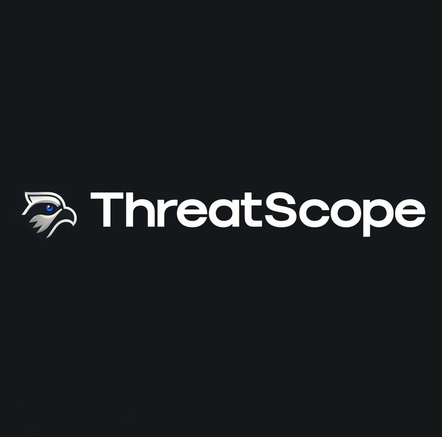

<div align="center">
  
  <h1>🛡️ ThreatScope</h1>
  <p><strong>A Privacy-First, Local Agentic AI Code Reviewer</strong></p>

  <p>
    
    
    
    
  </p>
</div>

---

> **ThreatScope** transforms your local machine into an automated, highly-intelligent code auditing powerhouse. It combines deterministic security tools with a probabilistic multi-agent AI framework to detect logic flaws, structural vulnerabilities, and syntax errors—all without ever sending a single line of your code to the cloud.

## 🚨 The Problem

Modern code reviews are either highly secure but "dumb" (static analysis/linters), or "smart" but privacy-invasive (cloud-based LLM scanners). Sending sensitive, proprietary codebase intelligence to external APIs poses a massive data leakage risk. Furthermore, traditional linters cannot understand complex business logic flaws or race conditions.

## 💡 The Solution

ThreatScope bridges this gap by deploying a **100% local, multi-agent AI system**. Relying on [Ollama](https://ollama.com/) and [CrewAI](https://www.crewai.com/), it orchestrates a specialized "crew" of AI personas (Summarizer, Syntax Reviewer, Logic Analyzer, Orchestrator) that audit your code structurally and logically, generating a comprehensive HTML dashboard. 

It also includes an **Offline OSV Vulnerability Scanner** and a **Defense-in-Depth Prompt Injection guard** to guarantee absolute security.

## 🌍 Real-World Traction

ThreatScope is currently in an active pilot program securing a live, LeetCode-style online compiler platform. It processes thousands of untrusted user submissions daily, proving its efficacy in a high-stakes, real-world production environment.

---

## ✨ Key Capabilities

*   **🔒 Absolute Privacy (100% Local Execution):** Your source code is analyzed securely offline. Zero data leaves your machine.
*   **🧠 Deep Agentic Intelligence:** Detects business logic flaws, race conditions, and structural vulnerabilities that standard linters miss, powered by `qwen2.5:7b` via Ollama.
*   **🤖 Multi-Agent Orchestration:** Specialized agents work in sequence. The output of one agent becomes the context for the next, resulting in highly contextual validation.
*   **🛡️ Universal Dependency Scanning:** Fully offline vulnerability scanner leveraging the Open Source Vulnerabilities (OSV) database covering `requirements.txt` (Python), `package.json` (npm), `go.mod` (Go), `pom.xml` (Maven), and `Cargo.toml` (Rust) simultaneously.
*   **🛑 Prompt Injection Defense-in-Depth:**
    *   **Pre-Flight Triage:** A specialized agent intercepts raw files to abort on adversarial payloads.
    *   **Randomized Sandbox Tags:** ThreatScope dynamically generates random XML delimiters (e.g., `<file_contents_a1b2c3>`) on every run, preventing data extraction or jailbreaking.
*   **📊 Beautiful HTML Reporting:** Generates a visually appealing, single-file HTML dashboard with code health scores, charts, and actionable metrics.
*   **⚡ Smart Caching:** Utilizes SHA-256 directory hashing to avoid redundant scans.

---

## 🛠️ Installation

### 1. System Requirements

*   **[Python 3.8+](https://www.python.org/):** Core runtime.
*   **[Ollama](https://ollama.com/):** For running the AI model inference locally.
*   **[Flake8](https://flake8.pycqa.org/) & [ESLint](https://eslint.org/):** Global installations required for syntax linters.

### 2. Setup Guide

The easiest way to get ThreatScope running is using the provided installation script, which automatically sets up a virtual environment, installs Python and system dependencies, and pulls the required local AI models.

```bash
git clone <repository_url> threatscope
cd threatscope

chmod +x install.sh
./install.sh
```

#### Manual Setup (Alternative)

If you prefer to install dependencies manually:

1. **Install System Dependencies:**
   ```bash
   pip install flake8
   npm install -g eslint
   ```

2. **Start Ollama & Pull the Required Models:**
   ```bash
   ollama pull qwen2.5:7b
   ollama pull nomic-embed-text 
   ```

3. **Clone & Install Python Dependencies:**
   ```bash
   git clone <repository_url> threatscope
   cd threatscope

   python3 -m venv venv
   source venv/bin/activate
   pip install crewai pydantic jinja2 beautifulsoup4
   ```

---

## 🚀 Usage

Launch the interactive CLI menu:

```bash
python main.py
```

### The Workflow

1. **Update Databases:** Select option `2` to download the latest offline OSV databases for PyPI, npm, Go, Maven, and crates.io.
2. **Scan Codebase:** Select option `1` and provide the path to your repository (e.g., `./codebases/my-project`).
3. **Execution:** ThreatScope kicks off. It hashes the directory, runs deterministic linters, pre-flights the code for prompt injection, and unleashes the AI Crew.
4. **Review Report:** The tool automatically opens `<folder_name>_threatscope_report.html` in your default browser.

---

## 🏗️ Architecture (The "Brain")

ThreatScope intelligently divides cognitive workload. 

<div align="center">
  
</div>

| Layer | Component | Responsibility |
| :--- | :--- | :--- |
| **Defense** | 🚨 Security Guard | Pre-flight triaging of code to intercept prompt injections before the main run. |
| **Deterministic** | 🔍 API / Regex Tools | Instantly extracts hardcoded URLs, IPs, and secrets. |
| **Deterministic** | 📦 OSV Scanner | Offline parser verifying local dependencies against OSV databases. |
| **Probabilistic** | �️ Summarizer | AI Agent mapping contextual logic, purpose, and operations globally. |
| **Probabilistic** | 💅 Syntax Reviewer | AI Agent auditing code modularity and architecture. |
| **Probabilistic** | 🕵️ Logic Analyzer | AI Red-Teamer locating logical flaws and race conditions. |
| **Probabilistic** | 👨‍💼 Orchestrator | AI QC manager organizing output into a final Pydantic object. |
| **Presentation** | 🎨 Reporter | Generates the dynamic HTML Dashboard from the Orchestrator's output. |

---

<div align="center">
  <p><i>Built for Privacy. Built for Security. Built for Developer Velocity.</i></p>
</div>